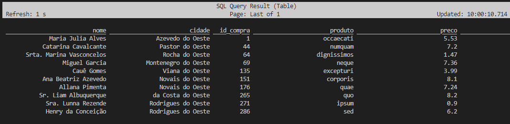
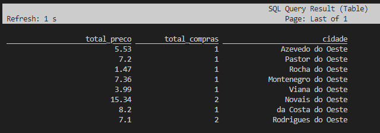
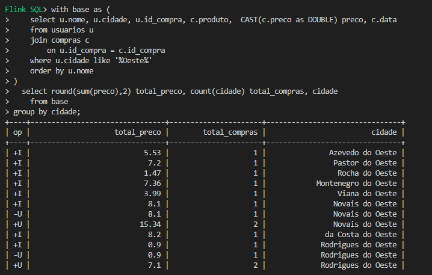

# Estudo 1

Neste estudo sendo aberto o SQL do Flink e vendo os dados do Kafka.

Base de Execução
```bash
# Sobe o playground
make playground_up

# cria os topicos
make topics_create

# entra no SQL Client
make sql_client

# remove topicos
make topics_delete

# para o playground
make playground_down
```


## Flink SQL Client
```sql

-- Config de saida 
-- https://nightlies.apache.org/flink/flink-docs-master/docs/dev/table/sqlclient/#sql-client-result-modes
set sql-client.execution.result-mode = tableau;
SET 'sql-client.execution.result-mode' = 'table';
SET 'sql-client.execution.result-mode' = 'changelog';

-- https://nightlies.apache.org/flink/flink-docs-release-1.14/docs/connectors/table/kafka/
-- Cria tabela usuarios
CREATE TABLE usuarios (
    cidade      STRING,
    nome        STRING,
    bairro      STRING,
    id_compra   INTEGER
) WITH (
    'connector' = 'kafka',
    'topic' = 'usuarios',
    'properties.bootstrap.servers' = 'host.docker.internal:29092',
    'properties.group.id' = 'group.usuarios',
    'scan.startup.mode' = 'earliest-offset',
    'format' = 'json'
);

-- Cria tabela compras 
-- Observe que o bootstrap server usado aqui se refere ao servico Kafka definido no docker-compose.yml
CREATE TABLE compras (
    id_compra   INTEGER,
    produto     STRING,
    preco       STRING,
    data        STRING,
    valor       INTEGER
) WITH (
    'connector' = 'kafka',
    'topic' = 'compras',
    'properties.bootstrap.servers' = 'kafka:29092',
    'properties.group.id' = 'group.compras',
    'scan.startup.mode' = 'earliest-offset',
    'format' = 'json'
);

-- exibe tabelas
show tables;

SELECT * FROM usuarios;
SELECT * FROM compras;

exit;
```


## Producer Python

```bash
make python_usuarios

make python_compras
```

## [Queries](https://nightlies.apache.org/flink/flink-docs-release-1.20/docs/dev/table/sql/queries/overview/#syntax)

```sql

-- Filtro simples
select cidade, nome
  from usuarios
 where cidade = 'Silveira';

-- Filtro com like
select cidade, nome
  from usuarios
 where cidade like '%Oeste%';


-- join com limit
select u.nome, u.bairro, u.cidade, u.id_compra, c.produto, c.preco, c.data, c.valor
  from usuarios u
  join compras c
    on u.id_compra = c.id_compra
limit 15;

```
## Query - Group by, With, Cast
Aplicando Filtro e aplicando [CAST](https://nightlies.apache.org/flink/flink-docs-release-1.20/docs/dev/table/sql/queries/overview/#syntax) para tipo [DOUBLE](https://nightlies.apache.org/flink/flink-docs-release-1.19/docs/dev/table/types/) em um campo.

```sql
select u.nome, u.cidade, u.id_compra, c.produto, CAST(c.preco as DOUBLE) preco, c.data
  from usuarios u
  join compras c
    on u.id_compra = c.id_compra
 where u.cidade like '%Oeste%';
```


```sql
-- with e group by
with base as (
    select u.nome, u.cidade, u.id_compra, c.produto,  CAST(c.preco as DOUBLE) preco, c.data
    from usuarios u
    join compras c
        on u.id_compra = c.id_compra
    where u.cidade like '%Oeste%'
)
  select round(sum(preco),2) total_preco, count(cidade) total_compras, cidade
    from base
group by cidade;

```


Verificando que **Não tem o mesmo efeito de ordenação do Pentaho**.

```sql
with base as (
    select u.nome, u.cidade, u.id_compra, c.produto,  CAST(c.preco as DOUBLE) preco, c.data
    from usuarios u
    join compras c
        on u.id_compra = c.id_compra
    where u.cidade like '%Oeste%'
    order by u.nome
)
  select round(sum(preco),2) total_preco, count(cidade) total_compras, cidade
    from base
group by cidade;
```
> Observe pelo Changelog que quando identificou a mesma cidade (Novais do Oeste e Rodrigues do Oeste), houve um esfoço para fazer o update do valor. Ao final, resulta a tabela da figura anterior. 



