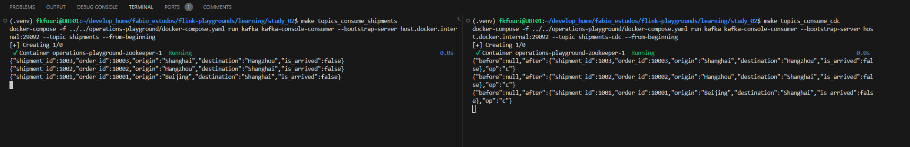

# Estudo 2

Neste estudo sendo utilizado o Flink Kafka e Kafka Upsert Demo

- [](https://youtu.be/1ezf3OyLz3w)
- [repo GIT](https://github.com/decodableco/examples/tree/main/flink-learn/2-kafka-upsert)
- [Postgres CDC Connector](https://nightlies.apache.org/flink/flink-cdc-docs-release-3.1/docs/connectors/flink-sources/postgres-cdc/)
- [Upsert Kafka SQL Connector](https://nightlies.apache.org/flink/flink-docs-master/docs/connectors/table/upsert-kafka/)


```sql
-- register a PostgreSQL table 'shipments' in Flink SQL
CREATE TABLE shipments (
  shipment_id INT,
  order_id INT,
  origin STRING,
  destination STRING,
  is_arrived BOOLEAN
) WITH (
  'connector' = 'postgres-cdc',
  -- ajustado para capturar o docker - by FK
  'hostname' = 'host.docker.internal',
  'port' = '5432',
  'username' = 'postgres',
  'password' = 'pwd',
  'database-name' = 'study',
  'schema-name' = 'public',
  'table-name' = 'shipments',
  'slot.name' = 'flink',
   -- experimental feature: incremental snapshot (default off)
  'scan.incremental.snapshot.enabled' = 'true'
);

-- read snapshot and binlogs from shipments table
SELECT * FROM shipments;
```


O Comando a seguir é para a execução no diretamente no Postgres.
```sql
INSERT INTO public.shipments
(shipment_id, order_id, origin, destination, is_arrived)
VALUES(nextval('shipments_shipment_id_seq'::regclass), nextval('shipments_order_id_seq'::regclass), 'Santos', 'Salvador', false);


UPDATE public.shipments
SET origin='Rio Grande', destination='Panama', is_arrived=false
WHERE shipment_id=1004;

DELETE from public.shipments
WHERE shipment_id=1004;
```

> Observe o mecanismo de changelog. Apareceu Insert, Update e Delete (coluna 1)


> Quando tentei inserir pelo SQL Flink obtive o seguinte erro.


## Propagando Dados do Flink para o Kafka

Para esse teste, é necessario criar topicos no Kafka.
```bash
make topics_create
```

Crie uma tabelas com conector para o Kafka

```sql
CREATE TABLE shipments_output_upsert (
  shipment_id INT,
  order_id INT,
  origin STRING,
  destination STRING,
  is_arrived BOOLEAN,
  --db_name STRING,
  --operation_ts TIMESTAMP_LTZ(3),
  PRIMARY KEY (shipment_id) NOT ENFORCED
 )
WITH (
  'connector' = 'upsert-kafka',
  'topic' = 'shipments',
  'properties.bootstrap.servers' = 'host.docker.internal:29092',
  'key.format' = 'json', 
  'value.format' = 'json'
);

```

Conectando uma tabela a outra.

```sql
INSERT INTO shipments_output_upsert SELECT * FROM shipments;
```


Ao exceutar o consumer a coisa não rolou como esperado...
```bash
make topics_consume_shipments
```
O Update e o Delete gerou as linhas nulas. 
 - Olhando o ID 1004, o primeiro foi um Insert ok
 - Ao fazer o Update, gerou um nulo (??) e uma linha com os dados corrigidos (Santos - > Rio Grande e Salvador -> Panama)
 - Ao fazer o Delete, Gerou um novo nulo (??)
 - Ao inserir novamente, apareceu Santos e Salvador.


## Emitindo Eventos de Mudança com Debezium-json
```sql
CREATE TABLE shipments_output_cdc (
  shipment_id INT,
  order_id INT,
  origin STRING,
  destination STRING,
  is_arrived BOOLEAN,
  --db_name STRING,
  --operation_ts TIMESTAMP_LTZ(3),
  PRIMARY KEY (shipment_id) NOT ENFORCED
 ) WITH (
  'connector' = 'kafka',
  'topic' = 'shipments-cdc',
  'properties.bootstrap.servers' = 'host.docker.internal:29092',
  'format' = 'debezium-json'
 );


INSERT INTO shipments_output_cdc SELECT * FROM shipments;
```


Ao exceutar o consumer a coisa não rolou como esperado...
```bash
make topics_consume_cdc
```

## Comparativos

Com os dados originais



Fazendo um INSERT


> por alguma razão, o segundo nao funcionoude acordo com o esperado. Pode ser que seja alguma limitação ou configuração errada do **debezium-json**. Mas segundo o link de referencia, era para aparecer status de atualização no Kafka.

